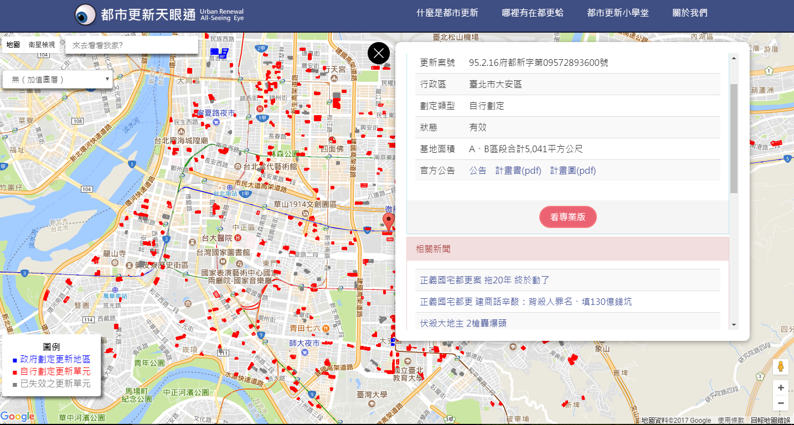

# UrbanRenewalEye: 都市更新天眼通(臺北市都市更新地圖)

## Contact

Jason Hsu: [@duidae](https://github.com/duidae)

## Background

都市更新天眼通希望以簡單易懂的都更簡介、簡易上手的都更地圖，與資訊豐沛的都市更新教室，結合民眾參與，使民眾、政府、民間單位能透過天眼通直觀有效的獲取各地都市更新資訊，以期讓民間能得到公開透明的資訊、協助政府未來都市更新、都市發展政策之研擬。

* [都市更新天眼通網站](https://urban-renewal.herokuapp.com)

* [都市更新天眼通FB粉專](https://www.facebook.com/urbanrenewaleye)

* [GitHub](https://github.com/duidae/UrbanRenewalEye)

## Installation & Running

[本地執行] (先安裝 node.js)
1. git clone https://github.com/duidae/UrbanRenewalEye.git
2. npm install
3. npm run hotbuild & (放到背景, 只要有修改就會即時編譯更新, 這部分是 front-end) (或 npm run build 只編譯一次)
4. npm run start (啟動 web server, 這部分是 back-end)

## Reference

* [臺北市都市更新處](https://uro.gov.taipei/Default.aspx)

* [聽証,公聽會(公民參與會議資訊)(json)](https://civil.gov.taipei/OpenData.aspx?SN=881665EB5B77192F)

* [臺北市自動化3D近似建物模型open data](http://data.taipei/opendata/datalist/datasetMeta?oid=9b7d78d2-0d73-4b42-9b29-c1640efed0eb)

* [建物3d+地圖](http://sheethub.github.io/tpe3d/3dtaipei4347-2.html)

* [空屋地圖](https://buzzorange.com/2016/09/13/ko-p-talking-about-living-justic/) 使用量低於 60 度以下的用戶才會被記為空屋

